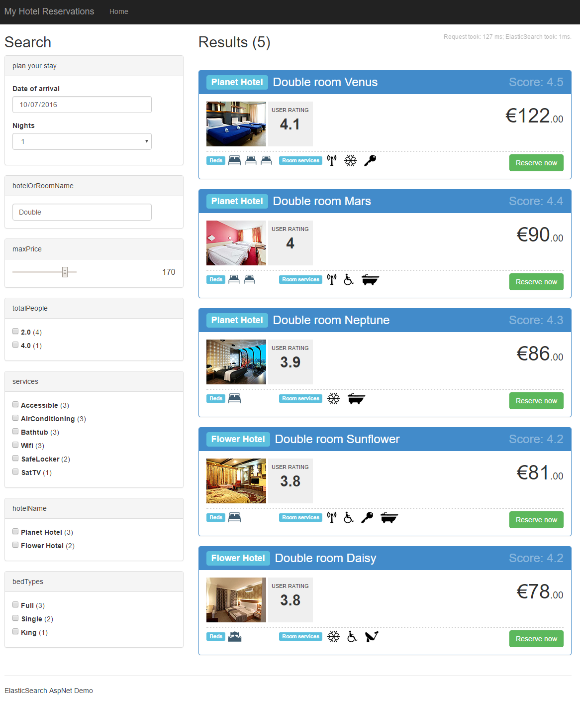

Hotel reservation demo with ASP.NET MVC 5 and ElasticSearch 
===========================================================

Welcome to this sample web application which consists in a hotel room reservation service.
This demo focuses on the usage of the [NEST client](https://www.elastic.co/guide/en/elasticsearch/client/net-api/2.x/nest.html) to query and manage an ElasticSearch index as a backend to the search functionality.

Use case
--------
As a user, you will select the date and number of nights you'd like to stay. The first 10 results are orderer by user rating and they will be shown on the right, with the option of loading more by clicking a button at the end of the list.
You will be presented with more filter options, such as services offered, number of people who're going to stay, bed types and hotel names. Order of results is highly influenced by user rating (the most liked will be at the top).

Rooms that can't accomodate you for the number of nights you selected won't be appear in the results.

> You can start right away: some dummy data (rooms and reservations) is automatically added for you at the application startup, so you'll see results for any date you select (select the present day, for instance). There are a total of 14 rooms in 2 hotels with 10 reservations distributed among them. Please check the [Seed method](https://github.com/BrightSoul/ElasticSearchAspNetHotelReservations/blob/master/AspNetElasticSearchDemo/Services/HotelReservationInitializer.cs#L14) of the Entity Framework initializer to see that data and suit it to your needs.

Requirements
------------
This is an ASP.NET MVC 5 project created on Visual Studio 2015. To make this demo work, you'll need ElastcSearch 2.x listening on the default port (9200) and an instance of Sql Server.
Please check the web.config file to ensure the connection string is valid for your machine.

Demonstrated features
---------------------
* Recreating an index and adding documents as a background job which is run by HangFire every minute. Its dashboard can be seen at /jobs;
* Querying documents and child documents by date, price and text;
* Use of "must" and "should" filters, which are dynamically added to the query depending on which filter criteria was selected by the user;
* Field score boosting;
* Suggestions shown as you type text;
* Document aggregations which will be used as filters (facets) to narrow down the results; 
* Paging of results;
* Scores and query durations are shown on the page;
* Use of KnockoutJS on the client side for data presentation.

NOT implemented in this demo
--------------------------------------
* Search by city / geographical search;
* Ordering/boosting by price or discount rate;
* The actual room reservation, as this demo focuses on search. Reservation entites can by added to the database by hand or via Entity Framework, though.

> Please note: this code is not intended to be used in production. For instance, the ElasticSearch index is deleted and recreated every minute and that makes users wait until then. This is, of course, far from ideal. Consider updating documents in response to domain events, instead.

Preview
-------
